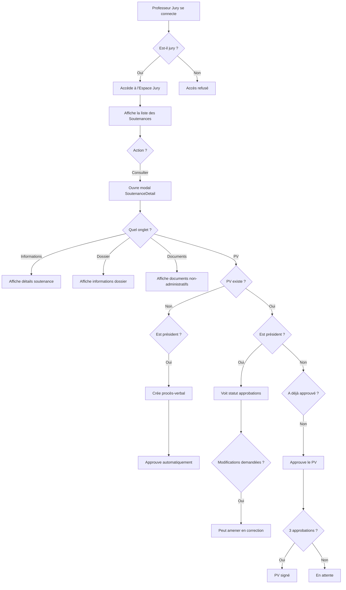

# Espace Jury

## Titre
Gestion des Soutenances par les Membres du Jury

## But
Permettre aux professeurs membres du jury de consulter leurs soutenances assignées, de voir les dossiers des candidats, de consulter les documents (hors documents administratifs), de créer ou approuver des procès-verbaux selon leur rôle, et d'amener en correction un mémoire si nécessaire.

## Prérequis
- L'utilisateur doit être connecté en tant que `professeur` et avoir le rôle `estJurie: true`.
- Des soutenances doivent être assignées au professeur en tant que membre du jury.
- Le professeur peut également être `estEncadrant: true` pour voir aussi les encadrements.
- **Règle métier importante** : Un professeur jury ne peut pas être membre du jury d'un candidat qu'il encadre (conflit d'intérêts). Les soutenances où le professeur est encadrant d'un des candidats du dossier sont automatiquement exclues de sa liste.

## Conditions / Préconditions
- L'utilisateur accède à l'espace jury via `/jurie/soutenances`.
- Le sidebar affiche "Espace Jury" et "Calendrier" (calendrier de soutenances) mais pas "Disponibilités" pour les jurys.
- Si le professeur est aussi encadrant, il voit également "Encadrements" dans le sidebar.
- **Filtrage automatique** : La fonction `getSoutenancesByProfesseur` exclut automatiquement les soutenances où le professeur est encadrant d'un des candidats du dossier associé à la soutenance.

## Postconditions
- **Consultation**:
    - Le professeur peut voir toutes les soutenances où il est membre du jury.
    - Il peut voir son rôle dans chaque jury (Président, Rapporteur, Examinateur, Encadrant).
    - Il peut consulter les informations de soutenance (date, heure, lieu, mode).
    - Il peut voir les dossiers des candidats et consulter leurs documents (sauf documents administratifs).
- **Création de procès-verbal** (Président uniquement):
    - Le président peut créer un procès-verbal avec note, mention, observations, appréciations et demandes de modifications.
    - Le président approuve automatiquement son propre procès-verbal.
    - Le procès-verbal nécessite 3 approbations (président + 2 membres) pour être signé.
- **Approbation de procès-verbal** (Membres non-présidents):
    - Les membres du jury peuvent approuver le procès-verbal créé par le président.
    - Une fois 3 approbations obtenues, le procès-verbal est signé.
- **Correction** (Président uniquement):
    - Le président peut amener un mémoire en correction si des modifications sont demandées dans le procès-verbal.

## Scénario Nominal (pas à pas)

1. **Connexion**: Le professeur jury (ex: `ibrahima.ndiaye@isi.edu.sn`, ID 2) se connecte.
2. **Accès à l'Espace Jury**: Il navigue vers l'espace jury via le sidebar (`/jurie/soutenances`).
3. **Liste des Soutenances**: Il voit la liste de toutes les soutenances où il est membre du jury, avec son rôle affiché pour chaque soutenance.
4. **Filtrage et Recherche**: Il peut filtrer par statut (Planifiées, Terminées) et rechercher par candidat ou titre du mémoire.
5. **Consultation d'une Soutenance**:
    a. Il clique sur "Consulter" pour une soutenance spécifique.
    b. Une modal s'ouvre avec 4 onglets : Informations, Dossier, Documents, Procès-verbal.
    c. **Onglet Informations**: Il voit les détails de la soutenance (date, heure, lieu, mode), les informations du candidat, et la liste des membres du jury avec leurs rôles.
    d. **Onglet Dossier**: Il voit les informations du dossier (titre, description, statut).
    e. **Onglet Documents**: Il voit tous les documents du mémoire (sauf documents administratifs) avec possibilité de visualiser ou télécharger.
    f. **Onglet Procès-verbal**: 
        - Si aucun PV n'existe et qu'il est président : il peut créer un procès-verbal.
        - Si un PV existe et qu'il n'est pas président : il peut l'approuver s'il ne l'a pas déjà fait.
        - Si un PV existe et qu'il est président : il peut voir le statut des approbations et amener en correction si des modifications sont demandées.
6. **Création de Procès-verbal** (Président):
    a. Il clique sur "Créer un procès-verbal".
    b. Il remplit le formulaire : note (0-20), mention, observations, appréciations, demandes de modifications (optionnel).
    c. Il clique sur "Créer le procès-verbal".
    d. Le PV est créé et automatiquement approuvé par le président.
7. **Approbation de Procès-verbal** (Membre non-président):
    a. Il voit le procès-verbal dans l'onglet "Procès-verbal".
    b. Il clique sur "Approuver le procès-verbal".
    c. Il confirme son approbation.
    d. Son approbation est enregistrée. Si 3 approbations sont obtenues, le PV est signé.
8. **Correction** (Président):
    a. Si le PV contient des demandes de modifications, le président peut cliquer sur "Amener en correction".
    b. Le mémoire est marqué comme nécessitant des corrections.

## Scénarios Alternatifs / Erreurs
- **Aucune soutenance assignée**: La page affiche un message informatif indiquant qu'aucune soutenance n'est assignée.
- **Accès non autorisé**: Si un utilisateur non-jury tente d'accéder à la page, il est redirigé avec un message d'accès restreint.
- **Note invalide**: Si le président saisit une note hors de la plage 0-20, un message d'erreur s'affiche.
- **Champs obligatoires manquants**: Si le président tente de créer un PV sans remplir les champs obligatoires, un message d'erreur s'affiche.
- **Approbation déjà effectuée**: Si un membre tente d'approuver un PV qu'il a déjà approuvé, l'action est ignorée.

## Exigences Fonctionnelles / Non-Fonctionnelles
- **F.1**: Le professeur jury doit pouvoir voir toutes les soutenances où il est membre du jury, **SAUF** celles où il est encadrant d'un des candidats du dossier (règle de conflit d'intérêts).
- **F.2**: Le professeur jury doit pouvoir voir son rôle dans chaque jury.
- **F.3**: Le professeur jury doit pouvoir consulter les informations de soutenance (date, heure, lieu, mode).
- **F.4**: Le professeur jury doit pouvoir voir les dossiers des candidats.
- **F.5**: Le professeur jury doit pouvoir consulter les documents des dossiers (sauf documents administratifs).
- **F.6**: Le président du jury doit pouvoir créer un procès-verbal.
- **F.7**: Les membres du jury (non-présidents) doivent pouvoir approuver un procès-verbal.
- **F.8**: Un procès-verbal doit être approuvé par 3 personnes (président + 2 membres) pour être signé.
- **F.9**: Le président doit pouvoir amener un mémoire en correction si des modifications sont demandées.
- **F.10**: Le sidebar doit afficher "Calendrier" (calendrier de soutenances) mais pas "Disponibilités" pour les jurys.
- **F.11**: Si le professeur est aussi encadrant, il doit voir "Encadrements" dans le sidebar.
- **NF.1**: L'interface doit être intuitive et facile à utiliser.
- **NF.2**: La consultation des documents doit être rapide et fluide.
- **NF.3**: Les actions de création/approbation de PV doivent être confirmées visuellement.

## Flow (Steps)

## Use Case
- **Acteur**: Professeur Membre du Jury
- **Déclencheur**: Le professeur souhaite consulter et gérer les soutenances où il est membre du jury.
- **Scénario**: Le professeur consulte les soutenances, voit les dossiers des candidats, consulte les documents, et selon son rôle (président ou membre), crée ou approuve des procès-verbaux.

## Données (Modèles utilisés)
- `Soutenance`: Modèle pour les soutenances.
- `MembreJury`: Modèle pour les membres du jury avec leurs rôles.
- `ProcessVerbal`: Modèle pour les procès-verbaux avec approbations.
- `DossierMemoire`: Modèle pour les dossiers des candidats.
- `Document`: Modèle pour les documents (filtrés pour exclure les documents administratifs).
- `Professeur`: Modèle pour les professeurs avec leurs rôles.

## Impact API (Endpoints)
- `GET /api/soutenances/by-professeur/{idProfesseur}`: Récupérer les soutenances où un professeur est membre du jury.
- `GET /api/soutenances/{idSoutenance}`: Récupérer les détails d'une soutenance.
- `GET /api/dossiers/{idDossier}/documents`: Récupérer les documents d'un dossier (filtrés pour exclure les administratifs).
- `POST /api/process-verbaux`: Créer un nouveau procès-verbal (président uniquement).
- `PUT /api/process-verbaux/{idPV}/approve`: Approuver un procès-verbal (membres non-présidents).
- `PUT /api/dossiers/{idDossier}/correction`: Amener un mémoire en correction (président uniquement).

## Tests Recommandés
1. **Test de connexion**: Se connecter en tant que professeur jury.
2. **Test d'affichage**: Vérifier que la liste des soutenances s'affiche correctement avec les rôles.
3. **Test de filtrage**: Filtrer par statut et rechercher par candidat/titre.
4. **Test de consultation**: Consulter une soutenance et vérifier tous les onglets.
5. **Test de documents**: Vérifier que seuls les documents non-administratifs sont affichés.
6. **Test de création de PV** (président):
    - Créer un procès-verbal avec tous les champs.
    - Vérifier que le PV est créé et automatiquement approuvé par le président.
7. **Test d'approbation de PV** (membre non-président):
    - Approuver un procès-verbal.
    - Vérifier que l'approbation est enregistrée.
    - Vérifier que le PV est signé lorsque 3 approbations sont obtenues.
8. **Test de correction**: Vérifier que le président peut amener un mémoire en correction.
9. **Test de permissions**: Tenter d'accéder à la page en tant qu'étudiant ou professeur non-jury (doit être redirigé).
10. **Test de sidebar**: Vérifier que les jurys voient "Calendrier" mais pas "Disponibilités", et "Encadrements" s'ils sont aussi encadrants.

## Notes / TO-DOs
- Implémenter les appels API réels pour la gestion des soutenances et procès-verbaux.
- Implémenter la logique complète pour "amener en correction" (mise à jour du statut du dossier et création de tâches).
- Assurer la gestion des erreurs pour les appels API.
- Ajouter des notifications lorsque des procès-verbaux nécessitent une approbation.
- **Règle métier implémentée** : La fonction `getSoutenancesByProfesseur` dans `Soutenance.ts` filtre automatiquement les soutenances où le professeur est encadrant d'un candidat du dossier, en utilisant `isProfesseurEncadrantDuDossier` qui vérifie les encadrements actifs du professeur.

